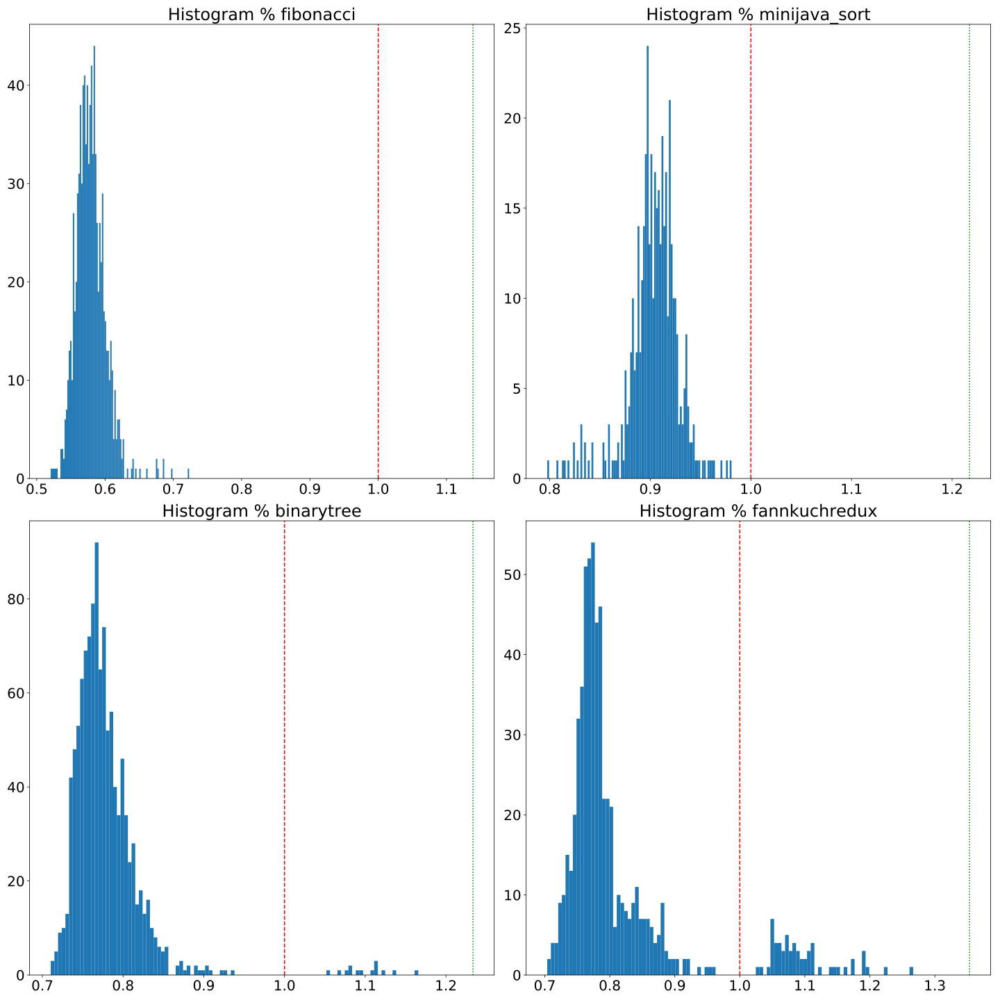

# Towards tailored compiled interpreters
{:.no_toc} 

This companion webpage presents complementary details to support the &lt;programming&gt;'20 paper.

<nav>
* hello
{:toc}
</nav>

## Abstract

## Automated feature selection

Node, @Child and @Children annotations code generation are guided by the structural definition of the language and are not subject to specific choices in the compiler.
The placement of Truffle boundaries, is driven by the need to isolate the interpreter from Java source code and is specifically defined to be compatible with the partial evaluation process of Truffle, as explained in the paper.
However, while the implementation of the polymorphic inline cache is abstracted through the dispatch keyword, it is still up to the developper to make a performance-related choice on the introduction of the keyword on the relevant methods.

As the dispatch keyword can be placed independently on each method without constraint, given $$N$$ the number of methods defined in an ALE interpreter, the number of valid combinations is $$2^N$$.
For instance, the MiniJava implementation is composed of 73 methods, consequently exploring the space exhaustively would mean $$2^{73} \approx 9.44\times10^{21}$$ combinations of dispatch.

To address this challenge we tried to identify fast interpreters using a genetic algorithm based approach.
Genetic algorithms are evolutionary algorithms inspired by the process of natural selection and are commonly applied to optimization problems.
Here we applied this technique to the search of the best configuration to obtain fast interpreters.

We based our implementation on the Jenetics[^1] java library that provides a framework for the implementation of genetic algorithms.
A genetic algorithm works by evolving an initial random set of configurations, called a population, over time.
Each configuration on a population is called an individual, and each variable part of an individual is called a gene.

The algorithm selects and mutates the current population in order to form a new population that is more fitted to answer the targeted problem.
The fitness of the individuals is obtained by applying a fitness function to each individual of the population.
A fitness function is a java method that takes an individual as an input, and returns a comparable (i.e., total ordering) value that represents its fitness.
In our case, the fitness function compiles an interpreter according to the individual genes and runs the benchmarks.
The average measured time is then returned.
From the fitness score of each individual, a new population is computed.
This population is composed of 60% of individuals from the previous population (i.e., survivors), and 40% of new individuals (i.e., offspring).
Survivors are selected through a tournament selection, where three random individuals are selected from the population, and only the best fitted is kept for the next generation. 
This operation is repeated until the number of survivors is reached.
The offspring are selected in the same way, but instead of being added to the population as-is, they are altered by two operations.
First, a single-point crossover is applied. This operation consist of the random selection of two offsprings, and mixing their genomes by random selection of a slicing point.
For instance from the slicing of two individuals $$a$$ and $$b$$ at index $$m$$, we obtain the following four sets $$\{a_{0}...a_{m}\},\{a_{m+1}...a_{n}\}={slice}_m(\{a_{0}...a_{n}\})$$ and $$\{b_{0}...b_{m}\},\{b_{m+1}...b_{n}\}={slice}_m\{b_{0}...b_{n}\})$$.
Those sets are recombined to form two new individuals $${\{a_{0}...a_{m},b_{m+1}...b_{n}\}}$$ and $${\{b_{0}...b_{m},a_{m+1}...a_{n}\}}$$ 
Finally, a random mutation is applied, on each gene with a probability of 15%.
The fitness function is configured to minimize the fitness value, in order to converge to the configuration that leads to the fastest interpreters.

The figure below presents the result of the application of the genetic algorithm presented above to the four programs of the MiniJava language.
All the measured times observed during the execution of the genetic algorithm are included in the histograms, 400 individuals have been generated during the evaluation of each program.
The red dashed vertical line represents the baseline (i.e., the Truffle-less version executed on Graal VM) and the green dotted vertical line represents the relative execution time of the Truffle-less version executed on Hotspot VM.
We can observe a Gaussian-like distribution of the measured times.
Since the exploration strategy is biased towards faster interpreters, most of the measures are faster than the baselines, but we can still observe that some mutations lead to slow results.

<i>Histogram of the execution times of the programs relatively to the baselines. The red dashed line represents the average execution time of the program on a Truffle-less implementation in the GraalVM JVM. The green dotted line represents the average execution time of the same Truffle-less implementation on the Hotspot JVM, relatively to the GraalVM JVM execution time.</i>

Through this approach we are able to identify fast combinations of dispatch use in the interpreter for each program.
While this approach is relevant to quickly specialize the interpreter for a single program, generalizing the approach to find a universal fastest interpreter over all programs is left as future work.

[^1]: Jenetics: [http://jenetics.io/](http://jenetics.io/)